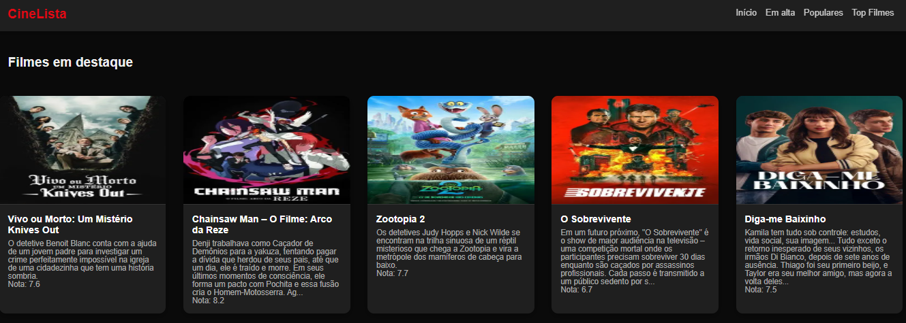

# 🎬 Cinelista: [Site](https://nextjs-cinelista-xi.vercel.app/)

Uma aplicação moderna de catálogo de filmes construída com **Next.js 16**, **TypeScript** e integração com a API do **TMDB** (The Movie Database).

## Propósito

Conversando com meus amigos, percebi que muitos tinham dificuldades em encontrar filmes.
Dito isso, decidi utilizar meus conhecimentos como desenvolvedor Front-end no intuito de criar uma aplicação para facilitar buscas.
Implementei o front-end em React, consumindo a API do TMDB.
O projeto foi usado por mais de 80 pessoas e me ensinou sobre autenticação e UX

## 🖼️ Captura de Tela



> Dica: se a imagem não aparecer, copie o arquivo da sua máquina para o repositório em `public/screenshots/cinelista_print.png`.

## ✨ Características

### 🎯 **Funcionalidades Principais**

- **Listagem de filmes** em alta/populares/top-rated
- **Detalhes completos** de cada filme
- **Theme switcher** (modo claro/escuro)
- **Design responsivo** e moderno
- **Animações fluidas** e efeitos visuais
- **Fallback inteligente** para dados locais

### 🎨 **Interface**

- **Componentes modulares** com CSS Modules
- **Gradientes modernos** e sombras profissionais
- **Botões animados** com hover effects
- **Layout flexível** adaptável a diferentes telas
- **Typography hierárquica** para melhor UX

### 🔧 **Tecnologias**

- **Next.js 16** com App Router
- **TypeScript** para type safety
- **CSS Modules** para estilização modular
- **Axios** para requisições HTTP
- **TMDB API** para dados de filmes reais

## ✅ Validação Técnica

Última validação: **2026-06-19**

- **Lint:** passou
- **Testes:** 4 suítes, 7 testes, todos passando
- **Build:** passou com sucesso
- **Observação:** warning informativo de baseline-browser-mapping ainda pode aparecer no terminal, sem impactar testes/build

Comandos executados:

```bash
npm run lint
npm run test:once
npm run build
```

## 🚀 Como Executar

### 1. **Clone o repositório**

```bash
git clone <url-do-repositorio>
cd cinelista
```

### 2. **Instale as dependências**

```bash
npm install
```

### 3. **Configure a API do TMDB (Opcional)**

```bash
# Crie o arquivo .env.local na raiz do projeto
TMDB_API_URL=https://api.themoviedb.org/3/
TMDB_API_KEY=sua_chave_da_api_aqui
```

**📝 Como obter a chave da API:**

1. Crie uma conta em [themoviedb.org](https://www.themoviedb.org/)
2. Vá em **Settings** > **API**
3. Solicite uma **API Key (v3 auth)**
4. Copie e cole no `.env.local`

### 4. **Execute o servidor de desenvolvimento**

```bash
npm run dev
```

Acesse [http://localhost:3000](http://localhost:3000) no seu navegador.

## 📁 Estrutura do Projeto

```
cinelista/
├── src/
│   ├── app/                    # App Router (Next.js 13+)
│   │   ├── components/         # Componentes reutilizáveis
│   │   │   ├── Card/          # Card de filme
│   │   │   ├── Grid/          # Grid de filmes
│   │   │   ├── Header/        # Cabeçalho
│   │   │   └── Footer/        # Rodapé
│   │   ├── filmes/            # Rotas de filmes
│   │   │   ├── [id]/          # Página de detalhes do filme
│   │   │   │   ├── page.tsx   # Componente da página
│   │   │   │   ├── not-found.tsx # Página 404
│   │   │   │   └── *.module.css # Estilos
│   │   │   ├── populares/     # Filmes populares
│   │   │   └── top-filmes/    # Top filmes
│   │   ├── layout.tsx         # Layout raiz
│   │   └── page.tsx           # Página inicial
│   ├── lib/                   # Utilitários e APIs
│   │   ├── api/               # Configuração de APIs
│   │   │   ├── axios.ts       # Configuração Axios
│   │   │   └── tmdb.ts        # Funções da API TMDB
│   │   └── filmes.js          # Dados locais de fallback
│   ├── types/                 # Definições de tipos
│   └── styles/                # Estilos globais
├── public/                    # Arquivos estáticos
└── docs/                      # Documentação
```

## 🎨 Componentes Principais

### **Card Component**

- **Hover effects** profissionais
- **Navegação** para detalhes do filme
- **Imagens otimizadas** com fallback

### **Grid Component**

- **Layout responsivo** com CSS Grid
- **Espaçamento consistente**
- **Adaptação automática** ao tamanho da tela

### **Página de Detalhes**

- **Layout moderno** com poster e informações
- **Botão animado** de voltar
- **Typography hierárquica**

## 🔄 Sistema de Fallback

A aplicação possui um **sistema inteligente de fallback**:

### ✅ **Com API configurada:**

- Carrega filmes reais da API do TMDB
- Dados sempre atualizados
- Maior variedade de filmes

### 🔄 **Sem API ou erro:**

- **Fallback automático** para dados locais
- **Aplicação nunca quebra**
- **Experiência consistente** para o usuário

## 🚀 Scripts Disponíveis

```bash
npm run dev          # Servidor de desenvolvimento
npm run build        # Build de produção
npm run start        # Servidor de produção
npm run lint         # Linting do código
npm run format       # Formatar código
npm run test:once    # Executar testes uma vez
```

## 🔄 CI/CD - GitHub Actions & Vercel

O projeto possui um pipeline CI/CD automatizado que:

### **Pipeline de Integração Contínua**

1. **Build Job**
   - Faz checkout do código
   - Instala Node.js 20
   - Instala dependências com `npm ci`
   - Executa build (`npm run build`)

2. **Tests Job** (depende do Build)
   - Executa linting (`npm run lint`)
   - Verifica formatação (`npm run format`)
   - Roda testes (`npm run test:once`)

3. **Deploy Job** (depende dos Tests)
   - Faz deploy automático para Vercel
   - Usa secrets: `VERCEL_TOKEN`, `VERCEL_ORG_ID`, `VERCEL_PROJECT_ID`

### **Configuração do Deploy**

Para fazer deploy automático:

1. **Adicione os Secrets no GitHub:**
   - `VERCEL_TOKEN` - Gere em https://vercel.com/account/tokens
   - `VERCEL_ORG_ID` - ID da organização Vercel
   - `VERCEL_PROJECT_ID` - ID do projeto Vercel

2. **Configuração no GitHub:**
   - Vá para **Settings** > **Secrets and variables** > **Actions**
   - Clique em **New repository secret**
   - Adicione cada um dos 3 secrets acima

3. **O deploy acontece automaticamente quando:**
   - Houver push na branch `main`
   - Arquivos em `src/**` ou `.github/workflows/**` forem modificados
   - Ou manualmente via `workflow_dispatch`

### **Verificar Status do Pipeline**

- Acesse a aba **Actions** do repositório
- Veja o status de cada job
- Clique no workflow para detalhes

## 🎯 Funcionalidades Futuras

- [ ] **Busca de filmes** por título/gênero
- [ ] **Paginação** para grandes listas
- [ ] **Filtros avançados** (ano, gênero, rating)
- [ ] **Lista de favoritos** com localStorage
- [x] **Theme switcher** (dark/light mode)
- [ ] **PWA** com offline support

## 🤝 Contribuições

Contribuições são bem-vindas! Agradeço desde já. Sinta-se à vontade para:

1. **Fork** o projeto
2. **Crie** uma feature branch
3. **Faça commit** das mudanças
4. **Abra** um Pull Request

## 📝 Licença

Este projeto está sob a licença **MIT**.

## 🙏 Agradecimentos

- **[TMDB](https://www.themoviedb.org/)** pela API gratuita de filmes
- **[Next.js](https://nextjs.org/)** pelo framework incrível
- **[Vercel](https://vercel.com/)** pela plataforma de deploy

---

**Feito para amantes de cinema** 🍿
